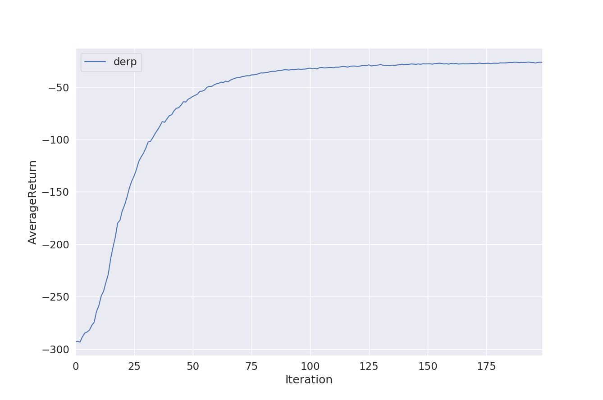
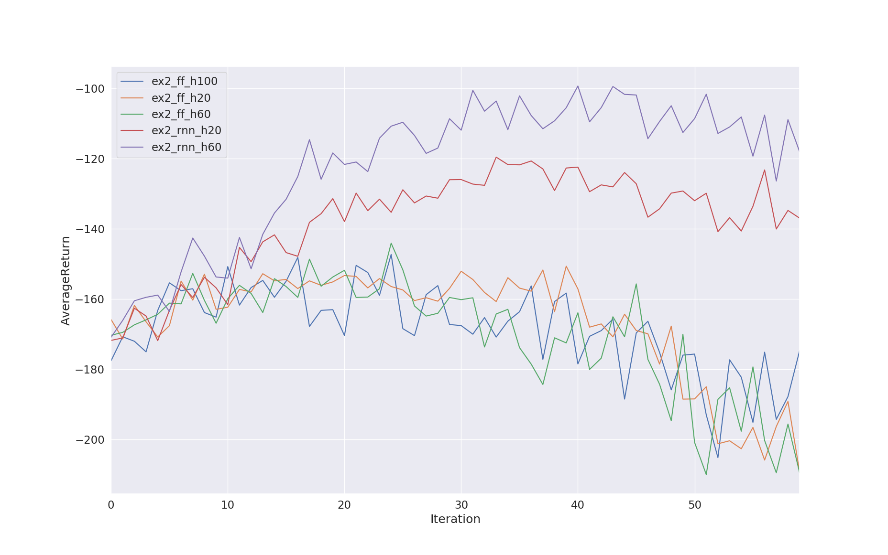
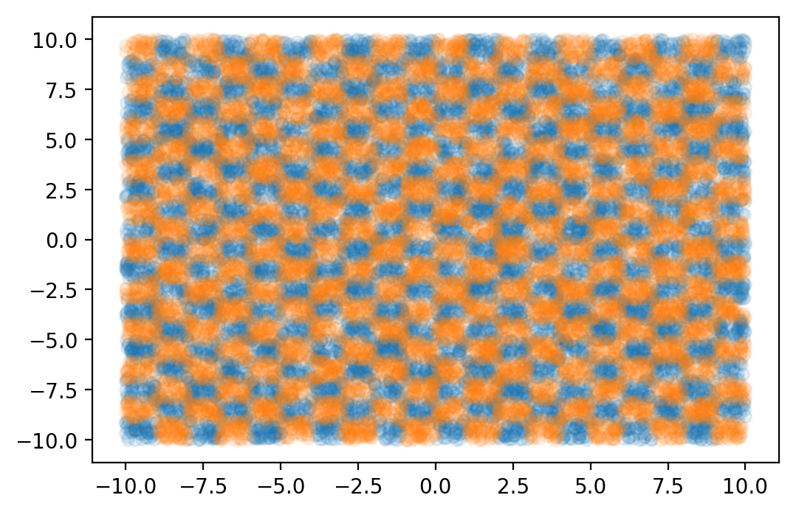
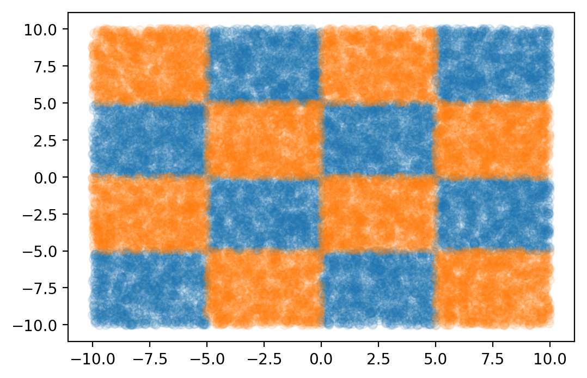
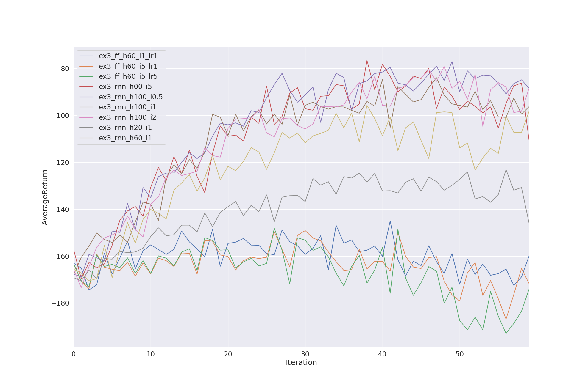

---
title: 'Deep RL HW5: Meta Reinforcement Learning'
author: Hannes Liik
date: April 21, 2019
...

# Problem 1: Contextual Tasks

In this problem, we have 4 different goals in the same environment.
We encode the goal in the observations with a one-hot vector.
This turns out to be a very effective way to use the same policy for several tasks.

*Figure 1: By using contextual IDs, the network manages infer the goal from the ID.*

# Problem 2: Meta-Learned Context / Learning to Learn

By observing the MDP, including the given rewards, the current goal should be able to be retreived.
The obvious architecture to use in this case is the Recurrent Neural Network (RNN), as it is able to capture information
from a long history and keep it in its hidden state. In this exercise, I experimented how long does the shown history need
to be in order for the network to be able to infer and achieve its goal. Furthermore, I compared the recurrent arcitecture to
the standard feed-forward architecture.

In order to make the experiment faster, I used the cuDNN compatible tensorflow GRU implementation. (It also seemed to give better results)

*Figure 2: Feed-forward architecture vs RNN, with different history lengths.*

From the results we can see that the simple feed-forward architecture is simply unable to solve the task. In fact, the performance drops over time.
Because the performance should stay the same, not drop further, there is the question of hyperparameters: LR too high? Or implementation errors.

The RNN architecture learns to perform for any history length, but it is clear, that more is better.

# Problem 3: Generalization

We managed to get the policy to solve many tasks it saw in training. What if in test time, the tasks are mostly the same, but the goal is not something that been seen
in training. In order to test this, we split the environment into training and evaluation goal areas with a checkerboard pattern:

*Figure 3: Checkerboard pattern with interval 1*

*Figure 4: Checkerboard pattern with interval 5*

I experimented with the policies on interval sizes 1 and 5. The smaller the interval size, the more uniform-ish the distribution,
and we would expect the policy to generalize better. The results suggest that the policy is able to cope well with the distribution shift, as seen in Figure 5.

*Figure 5: Policies performance with train-test distribution shifts.*

Because the distributions are different in a interpolating manner, I think the networks handle the distributions well. We know neural networks do interpolation *(citation needed)*.
We can see, that the network performance was the same with different intervals (`_i1_` vs `_i5_`) with same history size (100). I also expermimented with using smaller learning rates for
feedworward networks, but it made no difference.

